# 🎨 Md. Rifat Hossen — Graphic Design & Creative Media Portfolio

 

**Visual Storyteller • Brand Identity Designer • Motion Graphics Artist**  
*Chittagong University of Engineering and Technology (CUET)*

 

[📢 Event Posters & Banners](#-event-posters--marketing-banners) • 
[💎 Logos & Branding](#-logos--brand-identity) • 
[🎬 Motion Graphics](#-motion-graphics--video-editing) • 
[🏆 Certificates & Awards](#-certificates--honor-awards) • 
[👤 Editorial & Social Media](#-social-media--executive-profiles) • 
[📺 Thumbnails](#-youtube--video-thumbnails) • 
[📦 Vector Source Files](#-production-vector-source-files)

---

## 👨‍🎨 About Me

Welcome to my creative design portfolio! I am **Md. Rifat Hossen**, a graphic designer, visual artist, and motion editor. I specialize in crafting high-impact event branding, marketing posters, corporate identity assets, certificate designs, and motion opener animations. 

My work blends typography, photo manipulation, and balanced layouts tailored for university organizations, student branches (IEEE CS CUET, CUET Computer Club), student associations, and independent digital brands.

---

## 🌟 Featured Hero Works

### CUET Squad Conquers Bandarban — Adventure Tour Art
*Digital Photo Manipulation, Landscape Composition & Caricature Poster*  
**Tools:** Adobe Photoshop, Illustrator

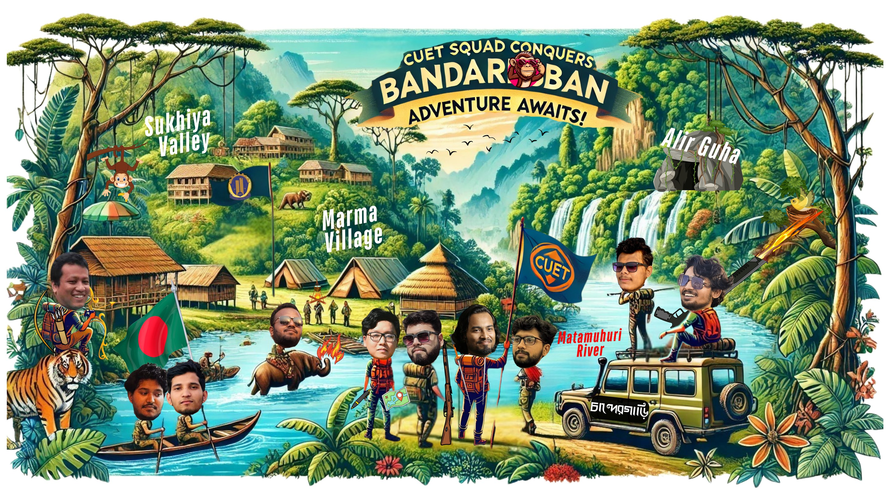

  

### IEEE Computer Society CUET Student Branch Chapter — Inauguration Ceremony
*Official Marketing Campaign Banner for Poster Presentation & Frontend Fusion Competitions*  
**Tools:** Adobe Illustrator, Vector Layout

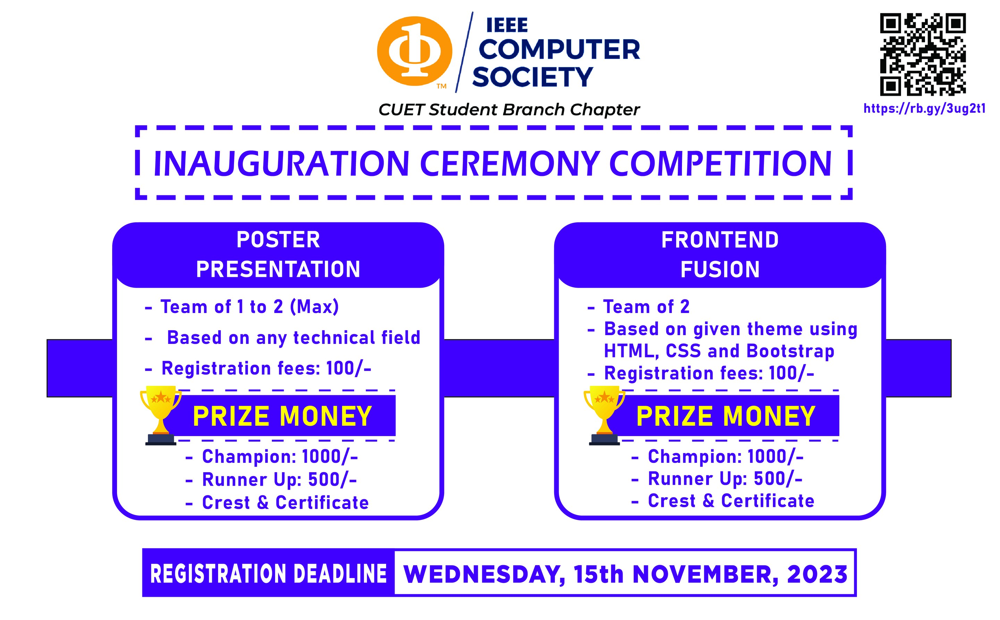

---

## 📢 Event Posters & Marketing Banners

A curated collection of event promotion collaterals, academic workshop announcements, sports fixtures, and festival banners.

### Vertical Event Posters & Announcements

  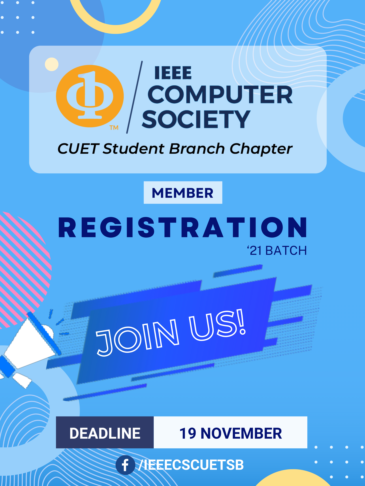
  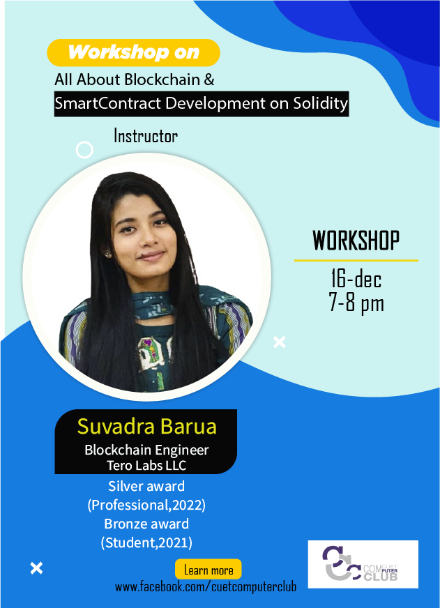
  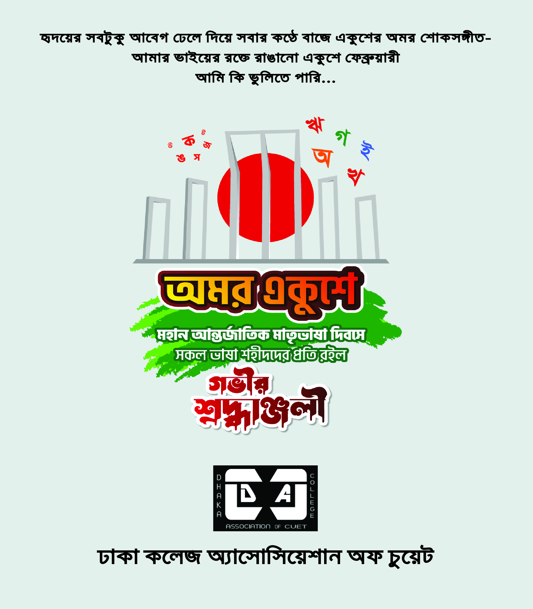

| Poster | Client / Context | Role / Details | Software Used |
| :--- | :--- | :--- | :--- |
| **IEEE CS Member Registration** | IEEE Computer Society CUET SB | Campaign flyer with modern geometry & typography | Adobe Illustrator |
| **Blockchain & Solidity Workshop** | CUET Computer Club | Technical workshop announcement poster | Adobe Photoshop / Illustrator |
| **International Mother Language Day** | Dhaka College Association of CUET | 21st February Shaheed Minar cultural tribute | Adobe Photoshop |

 

### Event Banners & Campaign Collaterals

  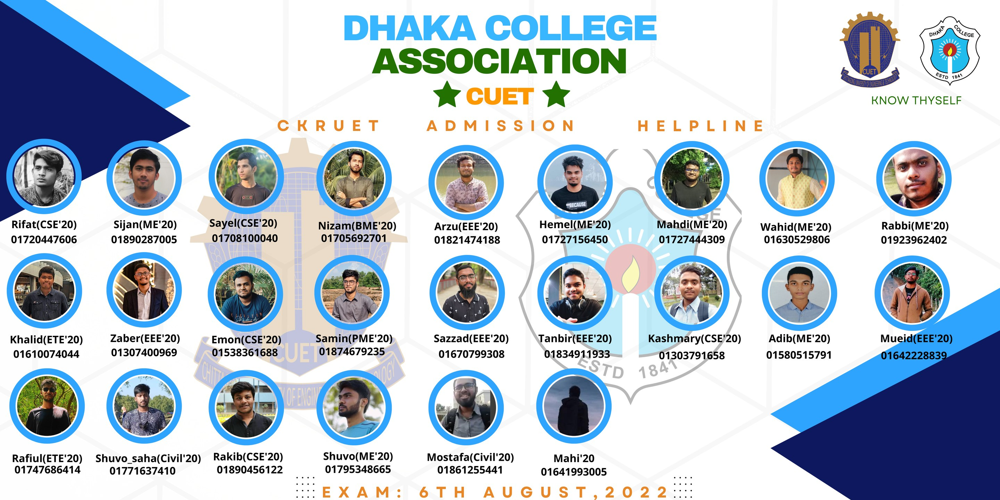
  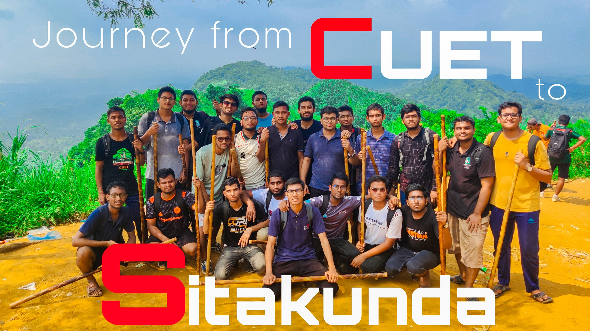

  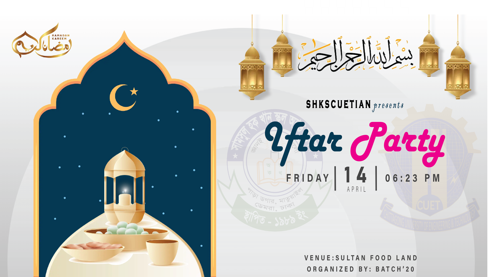
  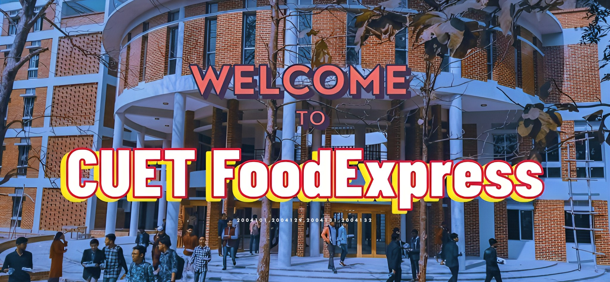

  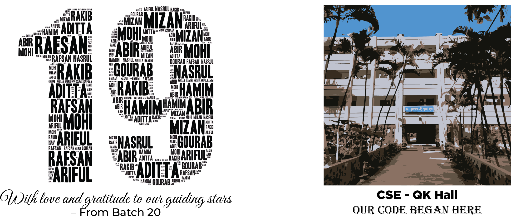
  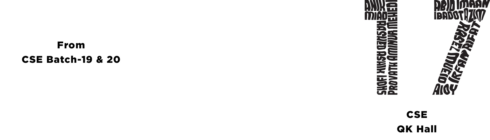

  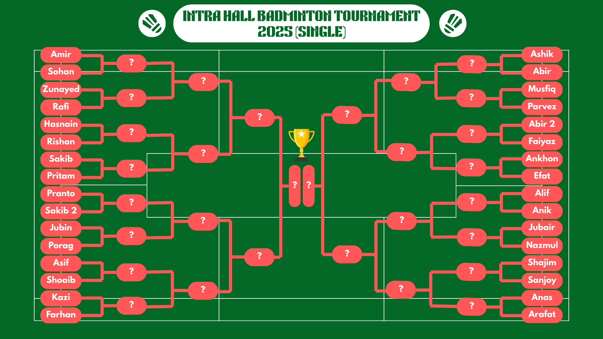

| Project | Client / Organization | Category | Tools |
| :--- | :--- | :--- | :--- |
| **CKRUET Admission Helpline** | Dhaka College Association of CUET | University admission support campaign | Adobe Photoshop |
| **Journey from CUET to Sitakunda** | CUET Student Tour | Landscape travel poster & photo manipulation | Adobe Photoshop |
| **Batch '20 Iftar Gathering** | SHKSCUETIAN | Islamic geometric & festive event banner | Adobe Illustrator |
| **CUET FoodExpress Promo** | FoodExpress Campus Venture | Commercial campus restaurant branding banner | Adobe Photoshop |
| **Senior Farewell 'Batch 16'** | CSE Department, QK Hall | Typographic name montage tribute poster | Adobe Illustrator |
| **Senior Farewell 'Batch 17'** | CSE Department, QK Hall | Modern typographic wall banner | Adobe Illustrator |
| **Intra Hall Badminton Fixture** | Hall Sports Committee | Tournament bracket infographic & schedule | Adobe Illustrator |

---

## 💎 Logos & Brand Identity

Original vector logos, university club crests, and identity monograms designed for digital platforms and print media.

  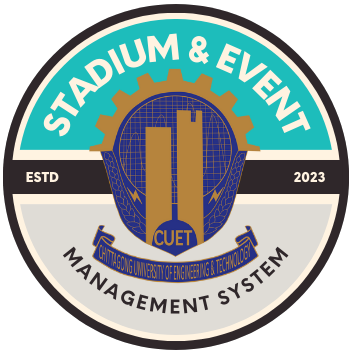
  &nbsp;&nbsp;
  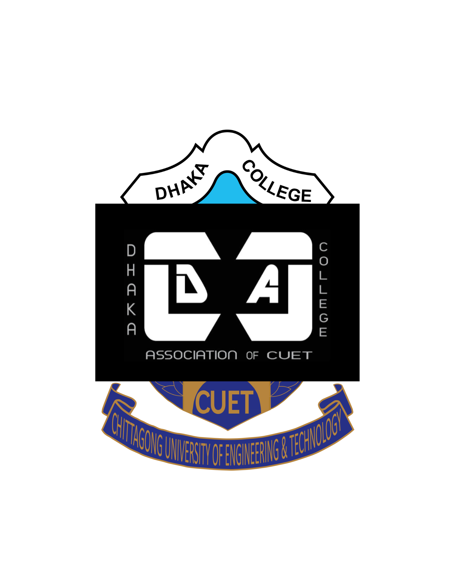
  &nbsp;&nbsp;
  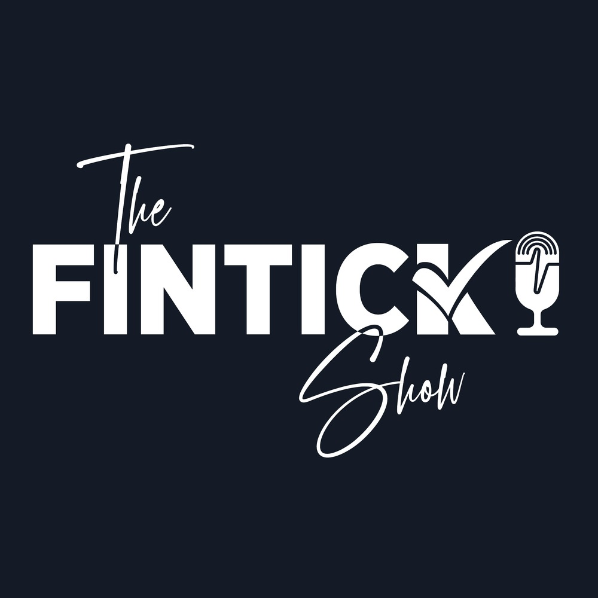
  &nbsp;&nbsp;
  

  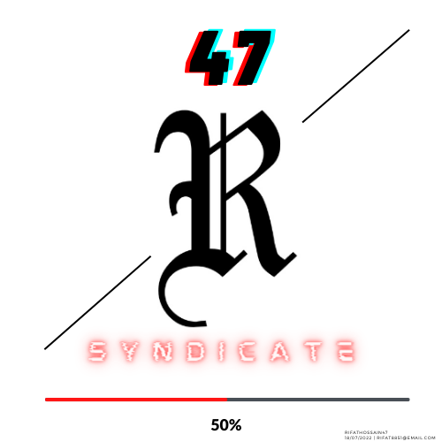
  &nbsp;&nbsp;
  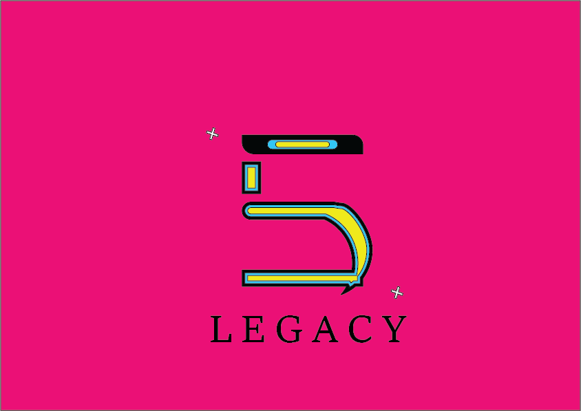
  &nbsp;&nbsp;
  

| Identity / Logo | Type | Description |
| :--- | :--- | :--- |
| **CUET Stadium & Event Management** | Circular Emblem Crest | Academic badge combining CUET monument, gear wheels, and athletic typography. |
| **Dhaka College Association of CUET** | Organization Crest | Stylized geometric 'DCA' ligature integrated with institutional crests. |
| **The Fintick Show** | Podcast / Media Brandmark | Contemporary microphone icon merged with bold sans-serif & script typography. |
| **Tricket** | Wordmark / Brand Logo | Modern organic dual-leaf swirl symbol for commerce/tech branding. |
| **47 R Syndicate** | Personal Brand Badge | Glitch aesthetic badge combining blackletter calligraphy with futuristic accents. |
| **5 Legacy** | Monogram Mark | Futuristic cyber-retro numbered monogram on vibrant palette. |
| **Gothic 'R' Monogram** | Calligraphy Art | Traditional Gothic Fraktur blackletter monogram illustration. |

---

## 🎬 Motion Graphics & Video Editing

Dynamic title sequences, animated logo reveals, and broadcast graphic cards produced with **Adobe Premiere Pro** and **After Effects**.

| Preview | Animation Project | Details & Technique | Watch |
| :---: | :--- | :--- | :---: |
|  | **The Fintick Show — Stroke Line Opener** | Smooth stroke outline animation transitioning into full typographic title reveal. | [▶️ **Play MP4**](Motion-and-Video/motion-fintick-logo-opener.mp4) |
|  | **The Fintick Show — Circle Wipe Reveal** | Modern broadcast circular wipe with color flash and badge positioning. | [▶️ **Play MP4**](Motion-and-Video/motion-fintick-logo-reveal.mp4) |
|  | **The Fintick Show — Intro Motion Sequence** | Multi-layer animated title sequence with signature accent sweeps. | [▶️ **Play MP4**](Motion-and-Video/motion-fintick-intro-animation.mp4) |
|  | **47 R Syndicate — Glitch Loop** | Cyber-glitch RGB chromatic aberration loop with progress bar animation. | [▶️ **Play MP4**](Motion-and-Video/motion-47-syndicate-loop.mp4) |
| ℹ️ | **Broadcast Notice — Motion Disclaimer Card** | Professional bilingual (English & Bengali) regulatory awareness card with subtle camera push-in. | [▶️ **Play MP4**](Motion-and-Video/motion-channel-disclaimer.mp4) |

---

## 🏆 Certificates & Honor Awards

Formal awards, honor plaques, and recognition certificates designed with elegant borders and balanced typographic hierarchy.

  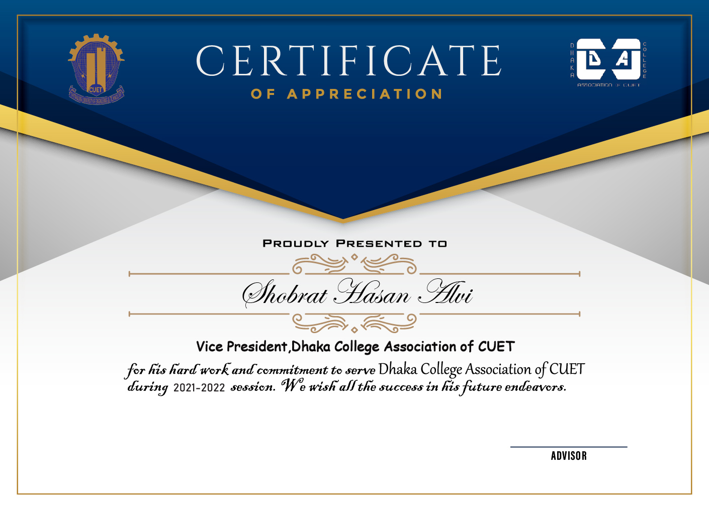
  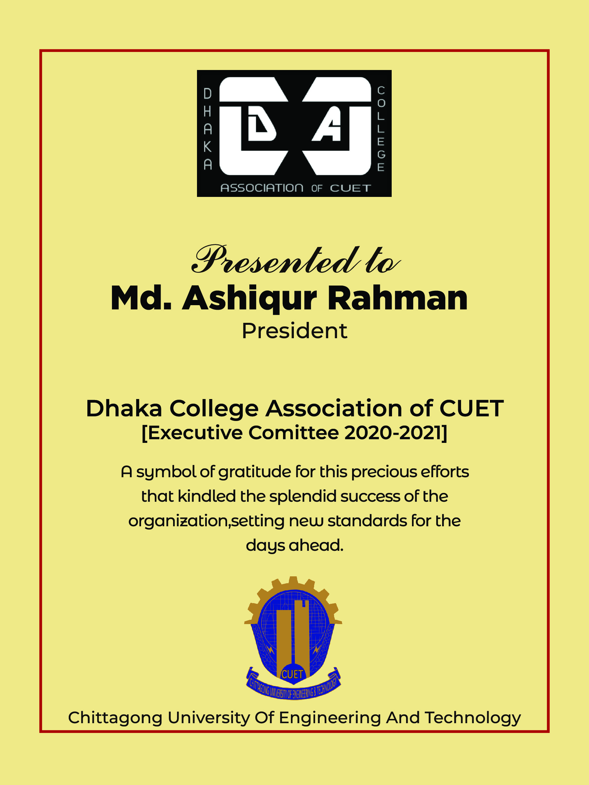

| Award Design | Recipient / Organization | Purpose | Tools |
| :--- | :--- | :--- | :--- |
| **Certificate of Appreciation** | Shohrat Hasan Alvi (Vice President, DCA CUET) | Formal recognition for leadership and dedication during the 2021-2022 tenure | Adobe Photoshop |
| **Honor & Gratitude Plaque** | Md. Ashiqur Rahman (President, DCA CUET) | Official plaque commemorating presidential contributions to the association | Adobe Illustrator |

---

## 👤 Social Media & Executive Profiles

Clean, uniform social announcement cards engineered for high visibility on Facebook, LinkedIn, and Instagram.

  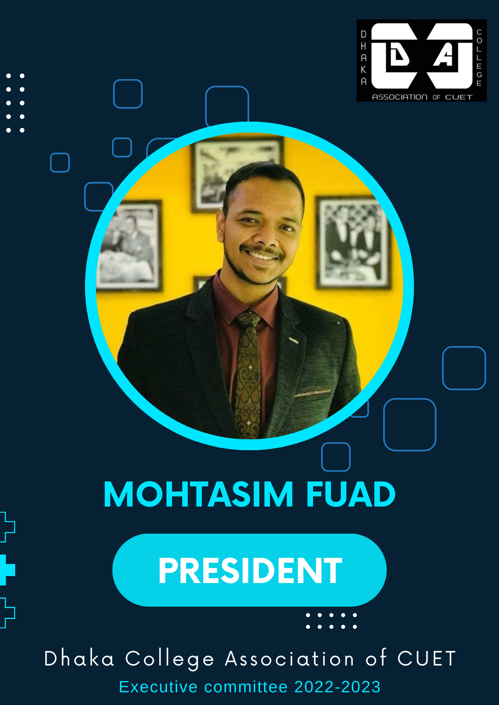
  &nbsp;&nbsp;&nbsp;&nbsp;
  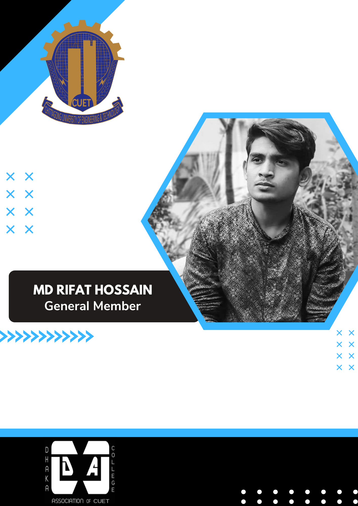

*   **Left:** *Presidential Announcement* — Dhaka College Association of CUET Executive Committee.
*   **Right:** *General Member Announcement* — Dhaka College Association of CUET.
*   **Design Focus:** Clean geometric framing, brand color consistency, high-contrast typography, and social media feed scannability.

---

## 📺 YouTube & Video Thumbnails

Click-worthy, high-contrast video cover thumbnails optimized for maximum click-through rates (CTR) on digital platforms.

  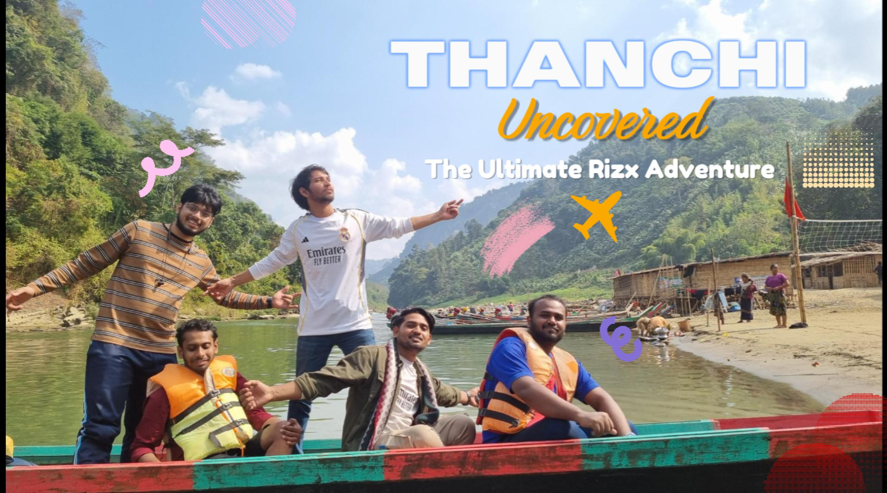
  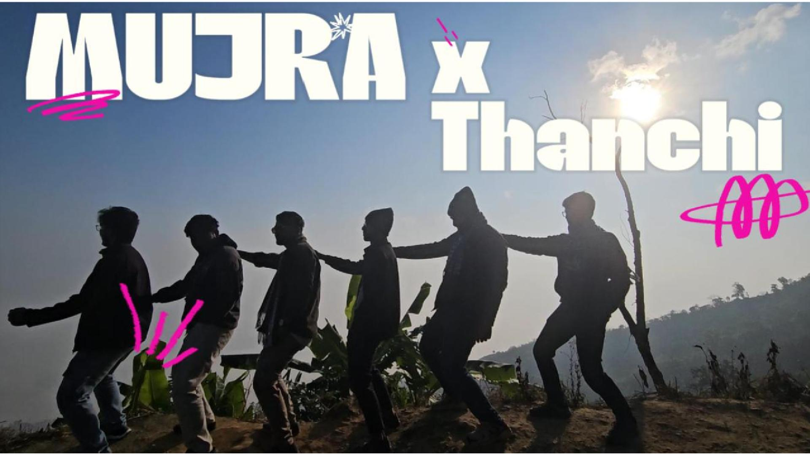

*   **Thanchi Uncovered:** Expressive group composition, custom sticker overlays, and bold 3D typography.
*   **Thanchi Adventure Vlog:** Silhouette sunset framing with brush-accent typography.

---

## 📦 Production Vector Source Files

All vector projects were built in Adobe Illustrator and are preserved in standard production formats (`.ai` / `.pdf`):

| File Path | Description | Format |
| :--- | :--- | :---: |
| [`Source-Files/banner-ieee-inauguration.ai`](Source-Files/banner-ieee-inauguration.ai) | Vector source for IEEE CS Inauguration Banner | `.ai` |
| [`Source-Files/banner-ieee-inauguration.pdf`](Source-Files/banner-ieee-inauguration.pdf) | Print-ready PDF vector export for IEEE CS Banner | `.pdf` |
| [`Source-Files/poster-blockchain-workshop.ai`](Source-Files/poster-blockchain-workshop.ai) | Vector layout for CUET Computer Club Workshop | `.ai` |
| [`Source-Files/banner-cse-farewell.ai`](Source-Files/banner-cse-farewell.ai) | Vector typographic artwork for CSE Senior Farewell | `.ai` |
| [`Source-Files/banner-iftar-ramadan.ai`](Source-Files/banner-iftar-ramadan.ai) | Vector artboards for Ramadan Iftar Gathering | `.ai` |
| [`Source-Files/logo-5-legacy.ai`](Source-Files/logo-5-legacy.ai) | Original logo vectors for 5 Legacy Brand | `.ai` |
| [`Source-Files/award-certificate-abir.ai`](Source-Files/award-certificate-abir.ai) | Certificate layout and vector ornament borders | `.ai` |
| [`Source-Files/crest-award-abir.ai`](Source-Files/crest-award-abir.ai) | Crest vector artboard for institutional plaque | `.ai` |
| [`Source-Files/invitation-letter.ai`](Source-Files/invitation-letter.ai) | Formal institutional invitation letter vector layout | `.ai` |

---

## 📬 Get In Touch

I am open to **freelance graphic design projects**, **creative design contracts**, and **full-time creative opportunities**. Let's build something remarkable together!

 

**Crafted with dedication by Md. Rifat Hossen**  
*CUET, Chattogram, Bangladesh*

